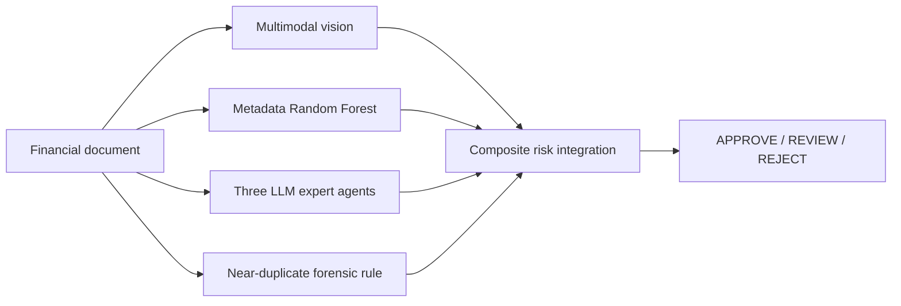

# AI-Powered Financial Document Fraud Detector

Academic group project developed at **LUISS Guido Carli University** for the *Introduction to Artificial Intelligence* course.

This repository is a cleaned portfolio version of the project. It demonstrates the design and implementation of a multi-channel prototype for assessing fraud risk in financial documents. It is **not a production fraud-detection system, not intended for automated financial decisions, and not presented as a novel research contribution**.

## Project overview

The pipeline combines several independent signals and integrates them into a composite 0-100 risk score with an `APPROVE`, `REVIEW`, or `REJECT` routing recommendation.



### Main components

- **Metadata classification:** calibrated Random Forest trained on a hybrid dataset.
- **Multimodal document analysis:** vision-based inspection of receipts, invoices, and bank statements.
- **Multi-agent risk assessment:** three specialised personas - forensic accountant, compliance officer, and quantitative risk analyst.
- **Risk integration:** weighted aggregation with a custom sigmoid transformation of the calibrated metadata probability.
- **Forensic rule:** near-duplicate invoice detection using supplier, amount, and time-window logic.
- **Streamlit interface:** browser-based prototype for uploading and analysing a document.
- **Reinforcement-learning analysis:** conceptual mapping of MDP/POMDP, Q-learning, DQN, and PPO to possible future routing improvements. RL is analysed, not deployed in the current system.
- **Optional email alerts:** SMTP-based high-risk notification flow using environment-managed credentials.

## Data and reported result

The project used a **12,000-invoice hybrid working dataset**:

- 10,000 invoices sampled from the public *Procurement Invoice Fraud Dataset* on Kaggle
- 2,000 synthetically generated observations used to preserve the original course component

The calibrated Random Forest achieved approximately **0.70 ROC-AUC on the held-out test set** in the project evaluation.

The repository intentionally does **not** redistribute the Kaggle-derived dataset, rendered third-party document images, generated result files, or the LUISS assignment brief. The notebook downloads the public dataset through `kagglehub` when run.

Dataset source: <https://www.kaggle.com/datasets/tokelomashile2/procurement-invoice-fraud-dataset>

## Repository structure

```text
.
├── README.md
├── fraud_detector.ipynb       # end-to-end research / experimentation notebook
├── streamlit_app.py           # browser demo
├── requirements.txt
├── .env.example               # credential template only - no secrets
├── .gitignore
├── NOTICE.md
├── data/
│   └── README.md              # data-source and redistribution note
└── docs/
    ├── architecture.md
    └── email_alerts_setup.md
```

## Quick start

### 1. Create an environment

```bash
python -m venv .venv
```

Activate it, then install dependencies:

```bash
pip install -r requirements.txt
```

### 2. Configure API keys

Copy `.env.example` to `.env` and add only the credentials you intend to use:

```bash
GEMINI_API_KEY=
OPENROUTER_API_KEY=
GMAIL_USER=
GMAIL_APP_PASSWORD=
FRAUD_ALERT_RECIPIENT=
```

`.env` is ignored by Git and must never be committed.

### 3. Run the notebook

```bash
jupyter notebook fraud_detector.ipynb
```

The notebook downloads the Kaggle dataset programmatically and reproduces the data preparation, model training, evaluation, integration logic, and optional multimodal experiments.

### 4. Run the Streamlit prototype

```bash
streamlit run streamlit_app.py
```

The Streamlit app is a lightweight demo. Its real-time metadata channel uses the project heuristic rather than loading the notebook's fitted Random Forest model, while the notebook contains the full trained-RF workflow.

## Security

No API keys or passwords are stored in this public version. Credentials must be supplied through environment variables or a local `.env` file.

If a credential has ever been committed, shared, or embedded in an earlier notebook, **revoke it and issue a new one**; deleting it from a later copy is not sufficient.

## Limitations

This is an academic prototype. Important limitations include dataset heterogeneity, external-API dependence, possible multimodal-model hallucinations, limited production explainability, sequential inference latency, and the need for human review in any real financial-services setting.

The near-duplicate forensic rule was retained as an informative negative result: on the project dataset it did not provide meaningful standalone discrimination, illustrating that a plausible control can fail to add signal when the dataset's fraud-generation process does not match the rule's assumptions.

## Attribution

This project was completed **collaboratively as a LUISS university group assignment**. This repository presents the work as a portfolio project and does not imply sole authorship of the complete original submission.

Third-party datasets, rendered document images, and course assignment materials remain subject to their respective owners' terms and are not included here.
